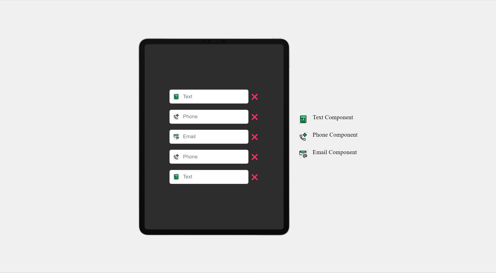

# Drag and Drop

#### Live Preview

You can access the live preview of the project by clicking [this link](https://front-end-study-case-3.vercel.app/).

#### Description

This HTML page includes a tablet simulation on the left and a component list on the right. When components (text, phone, email) are dragged, they create different input areas within the tablet. When the browser is opened in mobile view, the component list is hidden, and the tablet view becomes suitable for mobile devices. It aims to provide a user-friendly and mobile-responsive experience.

#### Screenshot-1

#### Screenshot-2

#### Screenshot-3

